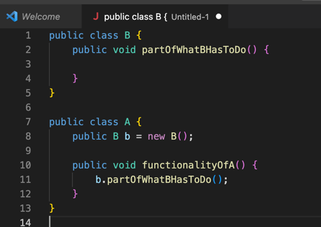

# Core Java

## Classes and Final modifier [ e-8 ]
* **Local Variable:**
  * Once we assign value to final variable, it is stored in memory from this time onwards we can't change it anymore.
  * var key word makes it mandatory to initialize at the time of declaration only.
  * Like this we make local variable constant.
  * Keep in mind that method parameters are also part of local variable.
* **class:**
  * If the class is final we can not extend it anymore. 
  * Sometimes we want once we have assign a value to an attribute of a class, that value should remain there for every 
  instance of that class i.e. constant. Those instance variable we can declare final.
  * So the attribute of that instance will be stored in the memory at the time you create the instance itself.
    * One of the way is simply provide the value in the blueprint itself. That is by using = operator.
      * But it's not vary practical in real life scenario. Because the value is fixed for every instance of that class.
    * In real life scenario even if we want to make the attribute constant, but specific to that instance itself
      * For Example: Bottle with attribute volume
      * For this we will initialize the attribute at the time of object creation i.e. inside constructor. Because 
      constructor is the place where instance is created.
    * Again it's not practical, but we can initialize in Anonymous block too. 
* **static Key word wrt variable:**
  * we can only declare variables of class as static. We can't have static variable somewhere locally.
  * When we declare a class variable as static, we say that the variable does not belong to the instance anymore.
  * Its called as class variable. This variable value is always same for that class, and to access it we don't  even 
  need have an instance. We can refer to the variable directly from class.
  * The basic different is that suppose we have a class Foo and a static variable y, no matter how many instances we create 
  for Foo, we will have only one y.
  * Even if you access the static variable by instance reference, at compile time it will be replaced by class name.
* **final and static modifier for variable:**
  * order of modifiers does not matter.
    `
      final static int x = 0;
      static final int x = 0;
    `
  * whenever you declare the variable we need to initialize it.
  * Again it's not recommended, but we can initialize static final variables in static block too.
*  **final with method:**
  * If the method is final we can not override it anymore though it can be inherited. But overloading does not care about final, so we can overload them.
## Static & Anonymous blocks in the class and Overloading
* Initialization of the variable done before the execution of the static block.
* When the class loaded for the 1st time into the memory all the static blocks executed in the order the way it is 
declared, and its only once.
* After that anonymous block and after that constructor will be executed every time you create an instance.

## Overloading
* Applies to methods as well as constructors in Java.
* Multiple methods with same identifier with in the same class, but the method should differ with parameter
(by number, by type of at least one of them, order of types).
* Only identifier and parameter are important when discussing overloading, so the return type of method is not 
important.
* access type(public, private ...) is not important.
* And can over load static method with non-static method.
* And it doesn't matter the return type as well as the exceptions its throwing.
    ` void a() {} `

    ` int a() { return 10; } // CE`
* For Java always first priority is to choose the methods for which no implicit conversion are needed.
  * Example: 
  * if we have two methods on takes int another double, we call method with int value, the method take int as 
    parameter will be executed.
  * If we delete the method having int parameter and call the method with int value, the method having double parameter
    will handle it.
  * But suppose we delete the method with double parameter and call the method having int parameter with double value we
    will get CE. One workaround will be call it like (int) 10.0.

## Packages and Access Modifiers
* default package does n't have any name.

## Encapsulation
* It's a way of writing a class, such that you can not work with the fields which represents data directly. You have to
  work with that in directly by using behaviour of the instance.
* can be done by declaring field as private access mode, can access through getter(accessor)/setter(mutator).
* And also calling directly fields and action on fields can't be intercepted in java as of Java 11. But in case of methods
  we can do that. For example frameworks are already doing it.
  * Smart Setter/Getter:
    * validation, computation etc inside setter/getter.
    * Not recommended as clean coding pov.
    * its breaking Single Responsibility also.

## Inheritance
* Let's say we have a class A, then whatever method or field its having we can say that it's owned by class A.
* class B extends A means B inherits from A,it inherits whatever is accessible depending on the access mode.
* Whenever blueprint/ class starts directly from something that already exists and then also able to change or add things
  that are inherited that is called as Particularisation and can be done in 4 ways:
  * add new fields
  * add new behaviours
  * change fields --> hiding fields (Not recommended in clean code)
  * change behaviour --> overriding
* **Particularisation:** whenever a blueprint makes an object more particular type than one that is inherited.
* **Uses:**
  * Avoid duplication code.
  * In real life for objects whatever things are common place in one place and by referring from other every time.
  * Example: Ships _looks like_ boat, but it's bigger. Like create the general image and go on more particular type.
* We have two kinds of **relationships** between prototypes of Object.
  * class Circle extends Shape --> circle **_is-A_** shape
  * class Owner **_has-A_** field Cat --> An object contain another object as field
* IS-A relationship happens in case of Inheritance. And Has-A relation happens in case of aggregation or composition.
* Multilevel inheritance in case of class is not possible i.e. we can not extend more than one class,
  if we did not extend any class by default its object class.

## Overriding (@Override just a source time annotation does not exist after compilation)
* Inheritance allows us in overriding.
* If you want to change the behaviour of inherited methods that called as overriding.
  * **1st rule:** is always to have same signature.
  * **2nd rule:** if the return type is Object then we can override with co-variant types (subtypes/child)
    i.e. we can override **Numeber** with **Integer**, Integer extends Number
  * **3rd rule:** while overriding we can use more public modes rather than private modes or same
    and keep in mind if the method is private in parent it's not inherited itself.
    * public > protected > package mode (default) > private
  * **4th rule:** we can avoid throwing exception while overriding, but we can not through wider range of exception then the
    method we override. Meaning we can override the method throwing IOException with its child FileNotFoundException.
    But can not override it by throwing Exception which will result in CE.
* We can redefine static methods also but being static it's not called as overriding.

## this(), super() and this, super
* If there is an inheritance between two classes, then when we create an object of second class the first thing will 
  happen is like it will call the constructor of first class in the default constructor.
* Because if you remember Particularisation, lets say class B extends A then Java has to know what A is before creating
  object for B.
* When a developer does not provide a constructor, class provides a default one. Inside that constructor first statement
  will be super().
* Let's say we make the class A constructor as private, then class B won't be able to call class A constructor and we will
  get compilation issue.
* super() and this() can't be used together and both are first instruction in the constructor.
* Super and this without parenthesis:
  * Super: represent the parent instance
  * this: represent the current instance
  * These two keywords can be used inside constructor as well as behaviour of the class.
## Polymorphism
* One specific instance can take the shape, can have a form of all the 
  more general types of the one that created instance.

  `  B b = new B(); `
  `  A a = new B(); `
  
  we can say that B can have the shape of B as well as shape of A.
  
* We can refer to an instance through all more general types of that object i.e. Parent ref can hold child instance. 
* when you store the reference of an instance in the variable of a specific type, the instance is still the same in the
  memory, the reference to the instance however stored in a different type and depending on the type in which you store
  the reference to the instance, you will have or not have the possibility to access some of the members.
* The rule being that you can access actually the members that are only declared and that are seen by the shape in which
  the reference of the object was stored.

## Abstract classes and Interfaces:
* In java, we are using two kinds of structure that we use in java when we declare abstract prototypes 
  i.e. abstract class and interface
* If we declare the class as abstract we can not instantiate that class.
* Rule: We can create an abstract class with non-abstract methods, 
  but we can not create abstract methods without any abstract class.
* We can create an empty abstract class too. 
  * ex: HttpServlet class
  * Another example would be if you want to create an api, you will always want to tell everything you need about your api
* By declaring class as abstract we just specified that this class is in incomplete prototype. 
  And this class has to be completed through inheritance by other classes.
* If the method is final we can not override it anymore though it can be inherited. 
  So we can not use final for abstract methods, it makes no sense.
* Same thing in case of class, if we make the class final it can not be inherited anymore.
  So we can not use final for abstract classes, it makes no sense.
* Abstract classes can contain constructors, because when other class inherits this class and implements its method 
  it will still call the parent class constructor.

### Interface:
* In java interface represents the contract. interface is still an abstract prototype.
  `public abstract interface Playable{}`
* Keep in mind the abstract key word is optional.
* Till java 7 only things we were able to declare inside interface are 
  * abstract methods (by default any method is public and abstract)
  * static final variables.
* From java 8 onwards we can declare non-abstract and static methods also in interface.
  * default is the new keyword inside interface, for default method still the package modifier is public only.
  * `
    public default void m() {
      System.out.println(":)");
    } 
  `
* From Java 9 onwards we can declare **static methods** inside interface, **private** also.
* When we inherit on interface from class we use implements keyword.
* Same rules for Polymorphism is also applies to interfaces. 
* We can inherit multiple inheritance, but wrt to class we can only inherit one class.
* `public class Monster implements Scary, StoryCharacter {}`
* `public interface Baz extends Foo, Bar {}`
* Interfaces are contracts abstraction between objects that define functionality of your application.
  For example:
  * If you have some kind of functionality where two objects use one each other to implement the algorithm 
  of your application. Let's assume we have object A and object B they are using each other to implement some functionality.
  
  

