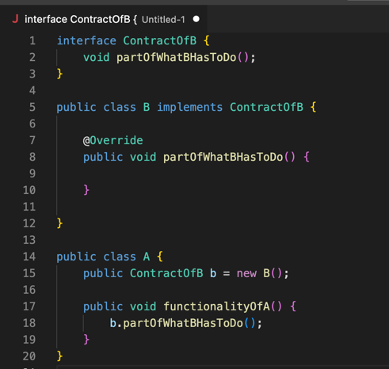
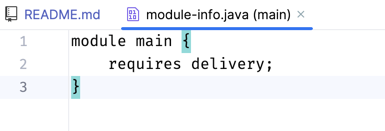
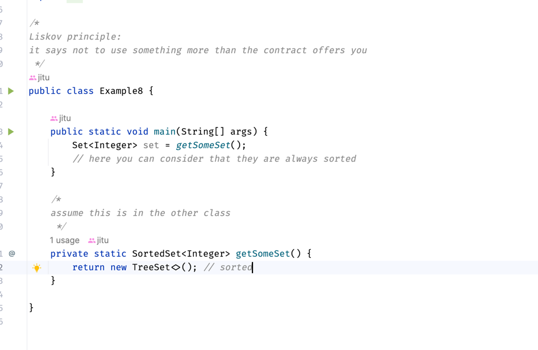

# Core Java

## Classes and Final modifier [ e-8 ]
* **Local Variable:**
  * Once we assign a value to the final variable, it is stored in memory from this time onwards we can't change it anymore.
  * var key word makes it mandatory to initialize at the time of declaration only.
  * Like this, we make local variable constant.
  * Keep in mind that method parameters are also part of local variable.
* **class:**
  * If the class is final, we cannot extend it anymore. 
  * Sometimes we want once we have assigned a value to an attribute of a class; that value should remain there for every 
    instance of that class, i.e., constant.
    Those instance variables we can declare final.
  * So the attribute of that instance will be stored in the memory at the time you create the instance itself.
    * One of the ways is to simply provide the value in the blueprint itself. That is by using = operator.
      * But it's not very practical in a real life scenario. Because the value is fixed for every instance of that class.
    * In real life scenario even if we want to make the attribute constant, but specific to that instance itself
      * For Example, Bottle with attribute volume
      * For this, we will initialize the attribute at the time of object creation i.e., inside constructor.
        Because constructor is the place where instance is created.
    * Again, it's not practical, but we can initialize in Anonymous block too. 
* **static Key word wrt variable:**
  * we can only declare variables of class as static. We can't have a static variable somewhere locally.
  * When we declare a class variable as static, we say that the variable does not belong to the instance anymore.
  * Its called as class variable, This variable value is always the same for that class, and to access it, we don't even 
    need to have an instance.
    We can refer to the variable directly from class.
  * The basic different is that suppose we have a class Foo and a static variable y, no matter how many instances we create 
    for Foo, we will have only one y.
  * Even if you access the static variable by instance reference, at compile time it will be replaced by class name.
* **final and static modifier for variable:**
  * order of modifiers does not matter.
    `
      final static int x = 0;
      static final int x = 0;
    `
  * whenever you declare the variable, we need to initialize it.
  * Again, it's not recommended, but we can initialize static final variables in static block too.
*  **final with method:**
  * If the method is final, we cannot override it anymore though it can be inherited. 
    But overloading does not care about finals, so we can overload them.
## Static & Anonymous blocks in the class and Overloading
* Initialization of the variable done before the execution of the static block.
* When the class is loaded for the first time into the memory,
  all the static blocks are executed in the order the way it is 
  declared, and its only once.
* After that anonymous block and after that constructor will be executed every time you create an instance.

## Overloading
* Applies to methods as well as constructors in Java.
* Multiple methods with the same identifier with in the same class, but the method should differ with parameter
(by number, by type of at least one of them, order of types).
* Only identifier and parameter are important when discussing overloading, so the return type of method is not 
important.
* access type (public, private ...) is not important.
* And can over load static method with non-static method.
* And it doesn't matter the return type as well as the exceptions its throwing.
    ` void a() {} `

    ` int a() { return 10; } // CE`
* For Java, priority always is to choose the methods for which no implicit conversion is needed.
  * Example: 
  * if we have two methods on takes int another double, we call method with int value, the method takes int as 
    parameter will be executed.
  * If we delete the method having int parameter and call the method with int value, the method having double parameter
    will handle it.
  * But suppose we delete the method with double parameter and call the method having int parameter with double value, we
    will get CE. One workaround will be call it like (int) 10.0.

## Packages and Access Modifiers
* default package does n't have any name.

## Encapsulation
* It's a way of writing a class, such that you cannot work with the fields which represent data directly.
  You have to work with that in directly by using the behavior of the instance.
* it can be done by declaring field as private access mode, can access through getter(accessor)/setter(mutator).
* And also calling directly fields and action on fields can't be intercepted in java as of Java 11. 
  But in the case of methods, we can do that.
  For example, frameworks are already doing it.
  * Smart Setter/Getter:
    * validation, computation etc inside setter/getter.
    * Not recommended as clean coding pov.
    * its breaking Single Responsibility also.

## Inheritance
* Let's say we have a class A, then whatever method or field its having we can say that it's owned by class A.
* class B extends A means B inherited from A;it inherits whatever is accessible depending on the access mode.
* Whenever blueprint/ class starts directly from something that already exists and then also able to change or add things
  that are inherited that is called as Particularisation and can be done in four ways:
  * add new fields
  * add new behaviors
  * change fields --> hiding fields (Not recommended in clean code)
  * change behaviour --> overriding
* **Particularisation:** whenever a blueprint makes an object more particular type than one that is inherited.
* **Uses:**
  * Avoid duplication code.
  * In real life for objects whatever things are common place in one place and by referring to the other every time.
  * Example: Ships _looks like_ boat, but it's bigger. Like create the general image and go on a more particular type.
* We have two kinds of **relationships** between prototypes of Object.
  * class Circle extends Shape --> circle **_is-A_** shape
  * class Owner **_has-A_** field Cat --> An object contains another object as field
* IS-A relationship happens in case of Inheritance. And Has A relation happens in case of aggregation or composition.
* Multilevel inheritance in case of class is not possible, i.e., we cannot extend more than one class if we do
  not extend any class by default its object class.

## Overriding (@Override just a source time annotation does not exist after compilation)
* Inheritance allows us to override.
* If you want to change the behavior of inherited methods that called as overriding.
  * **First rule:** is always to have the same signature.
  * **Second rule:** if the return type is Object, then we can override with co-variant types (subtypes/child)
    i.e. we can override **Number** with **Integer**, Integer extends Number
  * **Third rule:** while overriding, we can use more public modes rather than private modes or same
    and keep in mind if the method is private in parent it's not inherited itself.
    * public > protected > package mode (default) > private
  * **Fourth rule:** we can avoid throwing exception while overriding,
    but we cannot through a wider range of exceptions than the method we override.
    Meaning we can override the method throwing IOException with its child FileNotFoundException.
    But cannot override it by throwing Exception which will result in CE.
* We can redefine static methods also, but being static it's not called as overriding.

## this(), super() and this, super
* If there is an inheritance between two classes, then when we create an object of second class, the first thing will 
  happen is like it will call the constructor of first class in the default constructor.
* Because if you remember Particularisation, lets say class B extends A then Java has to know what A is before creating
  an object for B.
* When a developer does not provide a constructor, class provides a default one. Inside that constructor first statement
  will be super().
* Let's say we make the class A constructor as private,
  then class B won't be able to call class A constructor, and we will get compilation issue.
* super() and this() can't be used together, and both are first instruction in the constructor.
* Super and this without parenthesis:
  * Super: represent the parent instance
  * this represents the current instance
  * These two keywords can be used inside the constructor as well as the behavior of the class.
## Polymorphism
* One specific instance can take shape, can have a form of all the more general types of the one that created instance.

  `  B b = new B(); `
  `  A a = new B(); `
  
  we can say that B can have the shape of B as well as the shape of A.
  
* We can refer to an instance through all more general types of that object i.e., Parent ref can hold child instance. 
* when you store the reference of an instance in the variable of a specific type, the instance is still the same in the
  memory, the reference to the instance, however, stored in a different type, and depending on the type in which you store
  the reference to the instance, you will have or not have the possibility to access some of the members.
* The rule is that you can access actually the members that are only declared and that are seen by the shape in which
  the reference of the object was stored.

## Abstract classes and Interfaces:
* In java, we are using two kinds of structure that we use in java when we declare abstract prototypes 
  i.e., abstract class and interface
* If we declare the class as abstract, we cannot instantiate that class.
* Rule: We can create an abstract class with non-abstract methods, 
  but we cannot create abstract methods without any abstract class.
* We can create an empty abstract class too. 
  * ex: HttpServlet class
  * Another example would be if you want to create an api, you will always want to tell everything you need about your api
* By declaring class as abstract, we just specified that this class is in incomplete prototype. 
  And this class has to be completed through inheritance by other classes.
* If the method is final, we cannot override it anymore, though it can be inherited. 
  So we cannot use final for abstract methods, it makes no sense.
* Same thing in case of class, if we make the class final, it cannot be inherited anymore.
  So we cannot use final for abstract classes, it makes no sense.
* Abstract classes can contain constructors, because when other class inherits this class and implements its method, 
  it will still call the parent class constructor.

### Interface:
* In java interface represents the contract used to decouple two implementations.
  Those two implementations had the privilege of knowing from the contract,
  one of them what should except to consume and the second one what should be implemented.
* Interface is still an abstract prototype.
  `public abstract interface Playable{}`
* Keep in mind the abstract key word is optional.
* Till java 7, the only things we were able to declare inside interface are 
  * abstract methods (by default, any method is public and abstract)
  * static final variables.
* From java 8 onwards, we can declare non-abstract and static methods also in interface.
  * **default** is the new keyword inside the interface, for default method still the package modifier is public only.
  * `
    public default void m() {
      System.out.println(":)");
    } 
  `
* From Java 9 onwards we can declare **static methods** inside interface, **private** also.
* From clean code point of view, avoid writing your own default methods.
* When we inherit an interface from class, we use implements keyword.
* Same rules for Polymorphism are also applied to interfaces. 
* We can inherit multiple inheritances, but wrt to class we can only inherit one class.
* `public class Monster implements Scary, StoryCharacter {}`
* `public interface Baz extends Foo, Bar {}`
* Interfaces are contracts abstraction between objects that define the functionality of your application.
  For example:
  * If you have some kind of functionality where two objects use one each other to implement the algorithm 
  of your application. Let's assume we have object A and object B they are using each other to implement some functionality.
  * 
  * The problem with the above approach is we directly couple these two objects,
    and when you couple two objects not only their responsibilities but also couple their implementations.
  * The difference when we will implement this using interfaces is that logically A and B are not completely related one
    to another, only their responsibilities are related.
    It Means that the implementation of responsibility of B is not important
  for A. The advantage of this is that if we have changed something in application in the future,
    lets say we found some 
  better way of doing it by new implementation,
    then we will less code and maintainability of the application increases.
  * 
### Marker Interface:
* If the interface does not inherit anything, it does not have any methods then its called as Marker Interface.
  It's just a way of marking characteristics of an object. 
  Then you can use **instance of** operator to check it's of what type.
* After annotations in Java 5 have been introduced nowadays, we are not using any more marker interfaces.
* Using annotations, we can mark classes, methods, constructors, parameters, and so on.
  And it's cleaner also So for Metadata, we are using annotations.

### How do we consider the default method in Interface?
* We can consider that the default method is a suggestion from Contract to how to implement a specific behavior.
  However, if we want to override it, we can do though.
  Generally, from clean code point of view avoid writing default methods.
  But in some rare scenarios for re-usability purpose, we use default methods.

* In the below case in class Foo, we will get compilation error because it inherits both method m() 
  and it has two default implementations. 
  * 
* However, if the class also inherits the methods from another class, then the method inherited from 
  the class has priority not the interface.
  And we will not get above a compilation problem.
  * 

### Where would be static methods used in interfaces?
* Again, in some cases, if you want to avoid duplication of code, then you might use static methods.
  * 
* And in the case of a factory design pattern also we can use static methods inside the interface. 
  Earlier, we used to create by help of an abstract class and static methods inside. 
  Or it was even a good idea to make it final class and make constructor private.

### When do you know that you need to decouple two objects?
* You will observe that in specific situations, if you only have one implementation and that will basically never change,
  then we can do the relationship directly with the objects.

### Functional Interfaces:
* As long as the interface consists of only one abstract method, it's known as Functional interface. 
  Keep in mind though it can contain multiple default and static methods. 
* For functional interfaces, we can use lambda expression.
  It adds some kind of functional syntax to java, just a way to
  write some shorter syntax for some interfaces.

## ENUMS:
* We can create an ENUM by **enum** keyword. We can imagine this as a class that defines from 
  the beginning that the number of instances we can use. And we cannot create another instance of that class.
* With enum, we always start with enumerating the instances of these types.
  In below SMALL, MEDIUM, BIG 
  are not some kind of primitive not Strings, they are an instance of the Coffee object.
  * 
* The equivalent of above if you want to write in Java is like below.
  * 

## Nested Types:
* Avoid them with respect to clean code pov. Because it creates high coupling.

## Modules: (Java 9 Project Jigsaw)

* It offers us some functionality that helps in keeping the application a little bit more decoupled and more
  maintainable.
* From Java 9 onwards, JDK itself became modular. In Java 8 we have only one big monolithic jar file which is called RT
  jar.
* But now we have modules
  * 
* Now instead of one jar file, we have multiple jar files.
  * Advantages:
    * First of all from the maintainability point of view, it helps us to keep our functionality decoupled.
    * Modules allow us strong encapsulation.
    * Public modifier in Java 8 means accessible everywhere, From Java 9 onwards It's accessible from outside of module
      only if you declare that.
    * Now we can choose which are the modules, that you want to deploy in your application.
      * Imagine that you have an application with more modules, and it happens sometimes that you don't want to install
        all
        of them, Why because your client will not use all of them.
      * Especially if you have a monolithic application, if you want to make it SOA, then the first step is to make it
        modularized. In short answer by the help of modules, you can choose which of the modules you want to deploy.
    * If you create an application with modules, then there is a tool in Java 9 called Jlink it will create a custom
      image of your JDK that will contain only the needed modules for your application based on your declaration.
    * In Java 8 just a hello world program will contain that 60–70MB of RT jar, that's not the case anymore from Java 9
      onwards.
    * Helps in containerization of the application.
* Once you create a module, we have to create a module deployment-descriptor file (module-info.java).
  * Inside this module descriptor we will add the specification of the module including what are the usages of the
    module,
    and what the module exports.
  * At least you should have a module name.
  * 
  * Dependencies between modules have to be explicitly declared. So a module basically has to specify which are the
    packages
    that are exported by that module, and it can export only part of the module. This is really helpful because now in a
    module
    you have functionality that is exported such that it can be consumed by the modules. But you have functionality that
    is
    purely hidden in the module itself and cannot be used from outside the module.
  * For example, in JDK itself, modules starting with jdk are internal.
  * 
* We can expose the package like below
  * 
* And then, wherever we require that module, we have to add that in module descriptor
  * 
  * 
* And along with that, we have to make sure the jar file of invoicing and delivery module know each-other.
  So to know each other, a new kind of path for modules is implemented in Java 9 and this is called module-path.
  Previously we only had classpath, and in the class path we add jar files which will contain classes that we will use
  in our functionality.
* However, in the case of module-path,
  the main difference is that when starting the application, all the modules will be checked according to their
  deployment-descriptor.
  If the module does not exist, the application will not start at all. Which is not the case in class path.
* For example, we have faced this issue: lets say we compile the application and then forget somehow to add the jar file
  to the class path,
  while starting the application nothing will happen and might be jar file will be used somewhere in the application for
  specific functionality, and it will fail at Runtime with NoClassDefFoundError only when the class tries to load by
  class loader.
* And we can only expose the contracts from the module instead of the whole package also. And let's say in our example
  delivery module requires invoice. And the main module requires delivery, let's say delivery module exposes some
  classes
  or exceptions from invoice module. In this, we cannot import those classes in the main module. There are two ways to
  solve
  this issue like we did in delivery module we can use require in the main module (Not recommended way).
  Or else we can use transitive key word in delivery module descriptor itself. So that whoever consumes delivery will
  get the
  invoice module also.
  * 
* Some developers even went further with this transitive keyword with modules, and they said I have some time the need
  of
  grouping part of modules, so i.e. I need just to be sure that if I need to add 10 modules then I have two options, I
  have
  to require all of them one by one into the module descriptor it will work.
  Then say we have 5 other modules need the same then we have to add these 10 lines everywhere, or we can simplify that.
  Let's create modules that do not contain any kind of functionality,
  let's create some modules that just add the transitive requirements.
  So that the one consumes that module will actually get no functionality from the module itself,
  but it will get all the modules that are transitive.
  * Example of above in JDK
    * 
## Collection Framework
* Collection<E> contains collection of single element i.e. List, Set, Deque, Queue
* In the collection is a group of elements that respect a kind of rules.

### List<E> --> ArrayList<E>, LinkedList<E>
* List<E> extends Collection<E> --> is one of the good examples for interface segregation principle.
  That says, instead of having an interface with all the behaviors, 
  you need to segregate them and to allow one to implement only the needed
  behavior from the specific contract.
* Whenever a method returns a contract, always takes them as contract.
  And always design your method to use interfaces rather than implementations.
  In this way, you decouple from the implementation, and you can change the implementation whenever
  needed afterward.
  This is known as **Liskov Principle**.
  * ` List<String> list = Arrays.asList("A", "B", "C");`
* List is a collection in which you have elements
  * might have duplicates
  * elements always have an order (not sorted)
  * each element has an index.
* While iterating a list with foreach loop if you are trying to change the list, we will get java.util.ConcurrentModificationException 
  * 
* Using Iterator is not recommended anymore wrt clean coding. Early days we were an iteration using iterator.
  * 
*  If we work with a lot of elements and remove a lot, then it's not recommended to use ArrayList,
   instead use Linked List.
   Linked List is a good choice to implement Stack and Queue also.
   ArrayList --> most used and simple.

### Set<E> --> HashSet<E>[not ordered, not sorted], LinkedHashSet<E>[ordered], TreeSet<E>[sorted]
* not (always) ordered
* not indexed
* doesn't allow duplicate
* **List(I)**
  * ordered                                 
  * indexed                     
  * do allow duplicates

* **Set(I) / SortedSet(I) / NavigableSet(I)**
  * not (always) ordered
  * not indexed
  * doesn't allow duplicate

* HashSet uses hashCode(), So it's the fastest collection in java in terms of finding an element.
* Whenever you are using HashSet with an own object, implement both hashCode() and equals() of object class.
* Contract between hashCode() and equals():
  * If two elements have the same hashCode (),
    they are not necessarily equal, but if the two elements are equal, they always have the same hashCode.
* LinkedHashSet --> Less fast than HashSet in terms of finding elements.
* **TreeSet** --> sorting is happened based on Comparator you provide or by using the natural sorting defined by the object.(Comparable)
* TreeSet extends NavigableSet, NavigableSet extends SortedSet
* TreeSet under the hood uses a **Black-Red** tree.
* Example of liskov principle:
  * 
  * 
* Comparable (I) --> Natural sorting order, override `public int compareTo(T o);`
  * 
* let's say we have a class from another library, we cannot change to sort that kind of object, we use Comparator<I>.
  * Comparator<Dog>  ->  int compare(Dog d1, Dog d2)
  * 
* **Deque**
  * Most used implementation of Deque is ArrayDeque.
  * Deque can be used to implement Stacks and Queues.
    * adding an element at the beginning
    * adding the element at the end also
    * retrieve/remove an element from the beginning
    * retrieve/remove an element at the end
    * Stacks works on LIFO, stacks have layers.
    * Deque something looks like below
       * beginning 1 2 3 4 5 6 end
  * 
* **Map** --> Collection of associations(pairs), Key-Value
* Even if the Map does not extend Collection, it is part of the Collection framework. 
  You can check the documentation also.
  * 
* Rules:
  * Keys are unique, instead of adding one more same key it will override.

